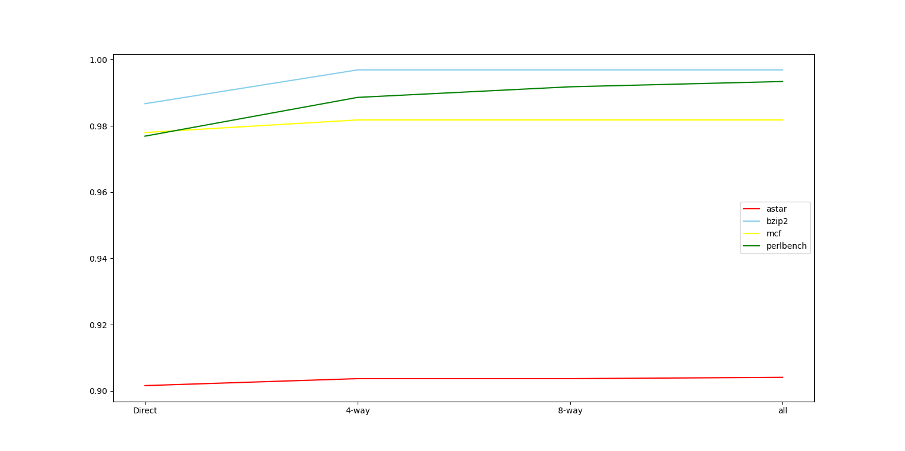
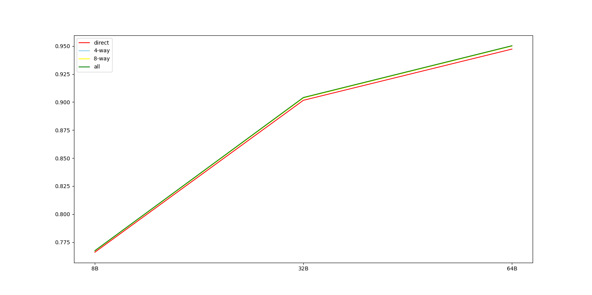

## Cache模拟实验

###### 计71 张程远 2017011429

#### **一、命中率与分析**

**（1）固定LRU，固定写分配+写回，尝试不同的组织策略和块大小**，命中率如下所示

|              | astar  | bzip2  | mcf    | perlbench |
| ------------ | ------ | ------ | ------ | --------- |
| 直接映射+8B  | 76.60% | 97.94% | 95.06% | 96.33%    |
| 直接映射+32B | 90.16% | 98.67% | 97.80% | 97.69%    |
| 直接映射+64B | 94.73% | 98.41% | 98.54% | 98.11%    |
| 4路+8B       | 76.72% | 98.78% | 95.42% | 97.93%    |
| 4路+32B      | 90.37% | 99.69% | 98.18% | 98.86%    |
| 4路+64B      | 94.99% | 99.85% | 98.92% | 99.15%    |
| 8路+8B       | 76.72% | 98.78% | 95.42% | 98.21%    |
| 8路+32B      | 90.37% | 99.69% | 98.18% | 99.18%    |
| 8路+64B      | 95.00% | 99.85% | 98.92% | 99.38%    |
| 全相联+8B    | 76.74% | 98.78% | 95.42% | 98.25%    |
| 全相联+32B   | 90.41% | 99.69% | 98.18% | 99.34%    |
| 全相联+64B   | 95.03% | 99.85% | 98.92% | 99.61%    |

下图是固定块大小32B，对于每个trace不同的组织方式命中率的曲线图

下图是固定trace为astar，对于每个组织方式采用不同的块大小命中率的曲线图

12种情况下Cache的元数据的情况：

|      | 直接映射                   | 4路组                      | 8路组                      | 全相联           |
| ---- | -------------------------- | -------------------------- | -------------------------- | ---------------- |
| 8B   | Tag 47, Index 14, Offset 3 | Tag 49, Index 12, Offset 3 | Tag 50, Index 11, Offset 3 | Tag 61, Offset 3 |
| 32B  | Tag 47, Index 12, Offset 5 | Tag 49, Index 10, Offset 5 | Tag 50, Index 9, Offset 5  | Tag 59, Offset 5 |
| 64B  | Tag 47, Index 11, Offset 6 | Tag 49, Index 9, Offset 6  | Tag 50, Index 8, Offset 6  | Tag 58, Offset 6 |

实验数据上来看，Cache块的大小越大，其命中率越好。这和课上讲授的内容稍有不同：课上认为随着Cache块变大，命中率应先升高再降低。由此可认为目前的块大小还比较小，提升块大小对命中率的提升是有效果的。另外，Cache的相联度越高，其命中率越好，但提升不明显。实际上Cache相联度高对命中率的提升也不是绝对的，也可以构造访存实例使得命中率降低。而且相联度的提升，会导致查询经历的块数增加，命中时间变长。因此我们在实际设计Cache系统的时候，应当选择适当的相联度和块大小，两者对于Cache而言都不是越大越好的。

**（2）固定8路组且块大小为8B，写回写分配，选择不同替换策略**，命中率如下所示

|        | astar  | bzip2  | mcf    | perlbench |
| ------ | ------ | ------ | ------ | --------- |
| LRU    | 76.72% | 98.78% | 95.42% | 98.21%    |
| 二叉树 | 76.71% | 98.78% | 95.42% | 98.22%    |
| 随机   | 76.78% | 98.78% | 95.40% | 98.21%    |

首先我们解释3种策略替换时的执行动作及实现方式。

LRU：长度为3个char的lrustack是LRU的栈。当发生缺失的时候，首先看缓存是否已经填满，如果未填满则选择第一个没有被填满的块，如果已经填满就从LRU中选择出被替换块的序号。char[0]是栈前8位，char[1]是栈8-15位，char[2]是16-23位，因此被替换块的序号应该就是char[2] >> 5的值。当访问一个块时，需要在lrustack里找到块序号的位置，然后把比块序号低的数据向高处移动，再把访问的块序号放到char[0]的最低位；全部操作都通过位运算完成。

二叉树：长度为1个char的lrutree是实现的二叉树结构。当发生缺失的时候，首先看缓存是否已经填满，如果未填满则选择第一个没有被填满的块，如果已经填满就从Tree中选择出被替换块的序号。我让char的第0位为根，1和2位为第二层，3456位为第三层，第7位闲置。替换时，根据节点的值，如果是0则向左，否则向右，直到找到被替换的块序号。当访问块时，如果块是某个节点的孩子，就根据是左孩子还是右孩子把块对应的节点相应置为1或0，其他节点不做修改。全部操作都通过位运算完成。

随机：不需要其他数据结构存储。当发生缺失的时候，首先看缓存是否已经填满，如果未填满则选择第一个没有被填满的块，如果已经填满就rand() % 8选择出被替换块的序号。

考虑实现耗费的空间：从上面的解释可以看出，LRU实现是耗费额外空间最多的，需要index*3个char存储栈，其中index是总块数除以组数；二叉树次之，需要index个char存储树结构；随机替换不需要耗费额外空间。

对于命中率的影响：LRU和二叉树算法实际上很好的利用了程序的局部性，因此如果希望两种算法大幅优于随机替换，那么需要实验数据能够比较好的体现程序的局部性，不过从最终结果来看，程序的局部性体现并不明显，亦或者rand也歪打正着地较好地实现了局部性（因为只是在8块里选择）。

**（3）固定8路组且块大小为8B，LRU替换策略，选择不同Cache写策略**，命中率如下所示

|                | astar  | bzip2  | mcf    | perlbench |
| -------------- | ------ | ------ | ------ | --------- |
| 写回写分配     | 76.72% | 98.78% | 95.42% | 98.21%    |
| 写直达写分配   | 76.72% | 98.78% | 95.42% | 98.21%    |
| 写回不写分配   | 65.50% | 91.33% | 88.85% | 95.34%    |
| 写直达不写分配 | 65.50% | 91.33% | 88.85% | 95.34%    |

由于本次实验只是模拟了cache，没有模拟主存，所以写回和写直达的区别只在于元数据中是否存在dirty位，所以对缺失率并没有影响；但是写不分配相比于写分配会极大降低Cache的命中率，因为写不分配意味着写内存时不会把内存存入缓存，这使得缓存相比于写分配的情况而言更空，因此缓存的命中率更低。由此也可以看出，4个重点trace中存在较多需要反复读写同一处内存的情况。

#### 二、实现细节

函数readafile：从指定路径读取trace文件内容。

函数getidmod：用来取操作数的低位，取的数量为index的长度。

函数pdhit和fillin：pdhit用来判断tag是否一样，fillin用来把tag填入cache里。

函数dolru：用来处理LRUstack。8路组的情况下会出现跨字节的情况，于是我索性枚举所有的情况，然后做相应的移位调整；4路组的情况下不会出现跨字节的情况，直接移位处理就可以了；全相联的情况下，栈的大小应该是Cache的大小，于是我索性把整个Cache当作栈，直接在Cache里做移位操作；直接映射则不存在LRU的使用，直接查找index，如果没中就直接填入，相当于栈的大小是1的情况

函数dotree和searchlrutree：上面已有介绍，我也是枚举所有情况然后填写相应的位，填0用与，填1用或。在搜索的时候，从根节点（最低位）开始查找，枚举所有的查找情况，返回序号。

main函数流程：首先读入数据，将操作符存入op，操作数存入v。通过临时变量获得index和对应的lru组号，接下来查找对应的index是否能够命中。如果命中，维护LRU栈和二叉树；如果没命中，则分两种情况，一种是Cache没满（存在valid是0的情况），那么先填入空的Cache，然后维护LRU栈和二叉树；如果满了，则从对应的替换策略拿出被替换者的序号，然后替换相应的Cache，并维护LRU和二叉树。如果是写不分配，那么如果一条'w'的记录没有命中，就不管它。